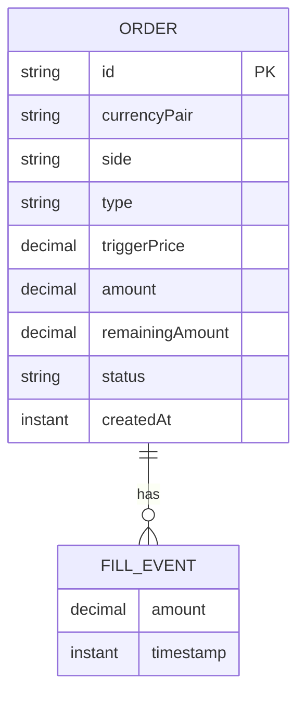

# Data model — manage-orders

## Convention source

No `docs/architecture-map.md` exists yet (survey has not been run on this repo — see sad.md §3 brownfield note). Conventions below are corroborated directly from the live code: `backend/src/main/java/com/currencyexchange/orderentry/model/Order.java` + `OrderStatus.java`, and confirmed with the user where the repo left something implicit (see the two Socratic decisions in "Open decisions resolved here").

**Database:** MongoDB (6.0.27 locally — see [[mongodb_windows_compat]] context), standalone single-node, no replica set, no multi-document transactions. Accessed via Spring Data MongoDB (`MongoRepository` +, per ADR-0001, `MongoTemplate`-based atomic conditional updates).

**No migration tool exists in this repo** (no Mongock/Liquibase/Flyway — `pom.xml` confirmed). MongoDB is schemaless: Spring Data maps POJOs directly, and a new field on `Order` requires no DDL. This is the repo's actual convention (implicit, by absence) — `data-model` follows it rather than introducing a migration framework unasked.

## Open decisions resolved here

1. **No migration files staged for this feature.** New fields (`remainingAmount`, `fillEvents`) are additive and need no DDL under Mongo's schemaless model. AC-11's gap (legacy `PENDING` orders with no `remainingAmount` ever recorded) is handled by a **computed read-path fallback** in `OrderService` (`effectiveRemaining = remainingAmount != null ? remainingAmount : amount`) — sad.md §11 already chose this over a backfill migration, and the user confirmed no backfill script should be staged either. See `_audit/` report.
2. **`FillEvent` has no `id` field** — just `amount` + `timestamp`. Fills are permanent and never individually referenced, corrected, or reversed (spec §3 non-goals); AC-08 only ever renders the full ordered trail, never a single fill by id.
3. **Rounding-safe representation for `remainingAmount`** (sad.md §11 flagged this as a blocking open question for this stage): store every amount-bearing field (`Order.amount`, `Order.remainingAmount`, `FillEvent.amount`) as `BigDecimal` normalized to a **fixed scale of 8** (`setScale(8, RoundingMode.HALF_UP)`) on write, applied uniformly in `OrderService` before persisting. Because every write lands on the same fixed scale, `remainingAmount.subtract(fillAmount)` is exact — no binary floating-point drift is possible, so the `PENDING → FILLED` transition can test `remainingAmount.compareTo(BigDecimal.ZERO) == 0` directly, with no epsilon/near-zero heuristic needed. This resolves the "phantom pending" risk at the representation level rather than with a fuzzy comparison.

## ER diagram

`FillEvent` is embedded inside `Order.fillEvents` (ADR-0001) — not its own MongoDB collection. The ER diagram shows it as a child entity for clarity; there is no separate `_id` or FK column because there is no separate document.

## Entities

### `Order` (existing `@Document("orders")`, extended)

| Field | Type | Constraints | Notes |
|---|---|---|---|
| `id` | `String` (Mongo default `_id`) | PK, Mongo-generated | unchanged |
| `currencyPair` | `String` | `^[A-Z]{3}/[A-Z]{3}$`, bean-validated on create | unchanged |
| `side` | `OrderSide` enum (`BUY`/`SELL`) | NOT NULL | unchanged |
| `type` | `OrderType` enum (`TAKE_PROFIT`/`STOP_LOSS`) | NOT NULL | unchanged |
| `triggerPrice` | `BigDecimal`, scale 8 | `> 0` | scale fixed by this feature (decision 3 above); existing values re-normalized to scale 8 lazily on next write, never batch-migrated |
| `amount` | `BigDecimal`, scale 8 | `> 0`, immutable after create | unchanged value, now scale-normalized |
| `remainingAmount` | `BigDecimal`, scale 8 | **nullable** — `null` on any order created before this feature (AC-11); `0 < value <= amount` while `PENDING` | **new.** Never `null` for an order created after this feature ships (`OrderService.createOrder` sets it equal to `amount` at creation) |
| `status` | `OrderStatus` enum (`PENDING`/`CANCELLED`/**`FILLED`** new) | NOT NULL | `FILLED` value added to the existing enum |
| `fillEvents` | `List<FillEvent>`, embedded | append-only; oldest-first insertion order is preserved (no re-sort needed — AC-08 requires oldest-first display) | **new.** Defaults to empty list; absent on any pre-feature order (treated as empty, same as an empty list) |
| `createdAt` | `Instant` | NOT NULL, set at creation | unchanged |

**Aggregate root:** `Order` is the aggregate root; `FillEvent` has no independent identity or lifecycle outside it (ADR-0001).
**Access patterns:** list all orders regardless of status (Critical flow 5) → no index needed, default collection scan is acceptable at this app's expected volume (single Trader, no pagination in scope); fetch/act on one order by id (all other flows) → served by Mongo's default `_id` index.
**Constraints:** none beyond bean validation at the DTO layer (`FillRequest`, `AmendRequest`, mirroring `CreateOrderRequest`'s pattern) — the repo does not use Mongo-level schema validators (`$jsonSchema`) anywhere today, so this feature does not introduce one.

### `FillEvent` (new, embedded — not a `@Document`)

| Field | Type | Constraints | Notes |
|---|---|---|---|
| `amount` | `BigDecimal`, scale 8 | `> 0`, `<= remaining amount at time of fill` (enforced by the atomic conditional update, ADR-0001) | |
| `timestamp` | `Instant` | NOT NULL, server-set (`Instant.now()`) at the moment the fill is recorded | never client-supplied — matches AC-03 ("the current time as its timestamp") |

**Aggregate root:** `Order` (embedded, no own collection, no own id — decision 2 above).
**Access patterns:** read as part of `Order` (no separate query — expanding a row in Critical flow 5 reads the already-fetched order's `fillEvents`); appended by the atomic conditional update in Critical flow 1. No index applies to an embedded, non-queried sub-document.
**Constraints:** append-only from the service layer; never mutated or removed once written (spec §3 non-goal — no correction/reversal path).

## Indexes

| Index | Columns | Query it serves |
|---|---|---|
| *(none added)* | — | Every access pattern in sad.md §6 is either a full unfiltered list (Critical flow 5 — AC-14 shows all statuses, no server-side filter) or a lookup by `_id` (already indexed by default). No sequence or AC calls for a filtered/sorted query that would justify a new index — adding one now would be "just in case." Revisit only if usage patterns change (e.g. a future status filter at scale). |

## Test fixtures

The repo has one test class (`OrderServiceTest`) and builds `Order`/`CreateOrderRequest` inline via constructors + setters — no factory/builder helper exists yet. This feature follows the same inline-construction style rather than introducing a builder pattern the repo doesn't otherwise use:

- Existing PENDING order with fills: `new Order(...)` then `order.setRemainingAmount(...)`, `order.setFillEvents(List.of(new FillEvent(amount, timestamp), ...))` — constructed inline per test, as `OrderServiceTest` already does for `Order`/`CreateOrderRequest`.
- Legacy PENDING order (AC-11 case): `new Order(...)` with `remainingAmount` left `null` and `fillEvents` left empty/`null`, to exercise the computed-fallback read path.
- No seed data — this is a single-user local tool with no bootstrap/lookup data requirement (sad.md §7 N/A).
