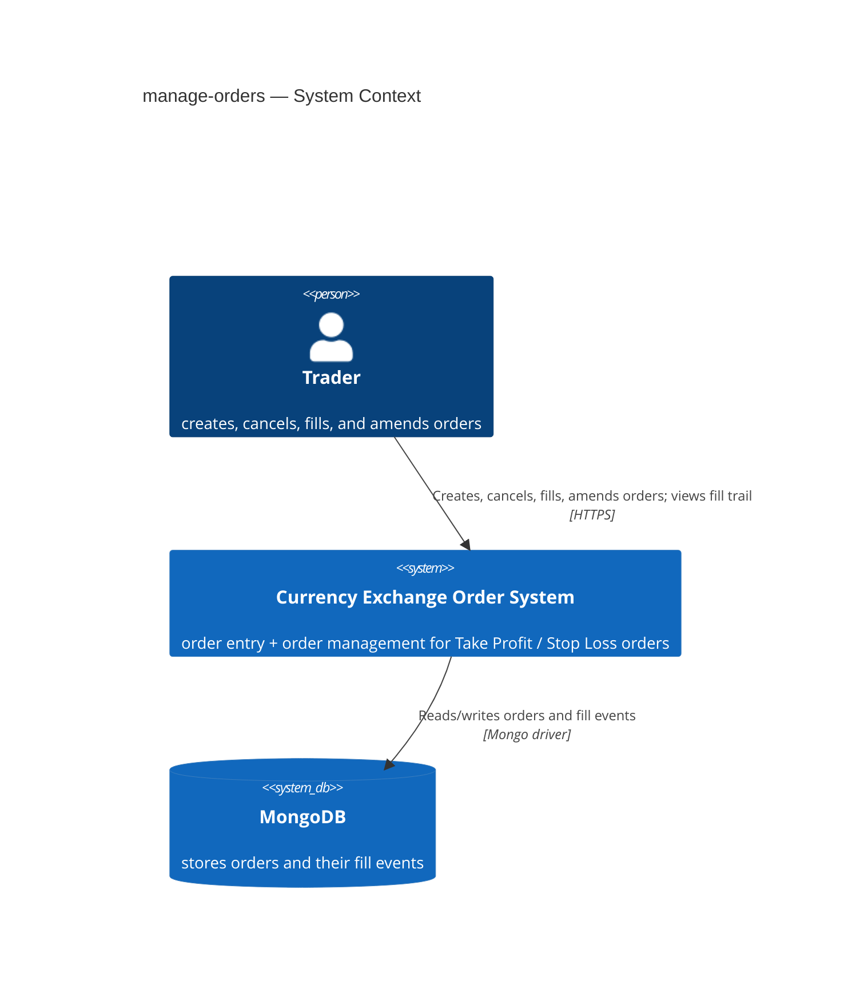
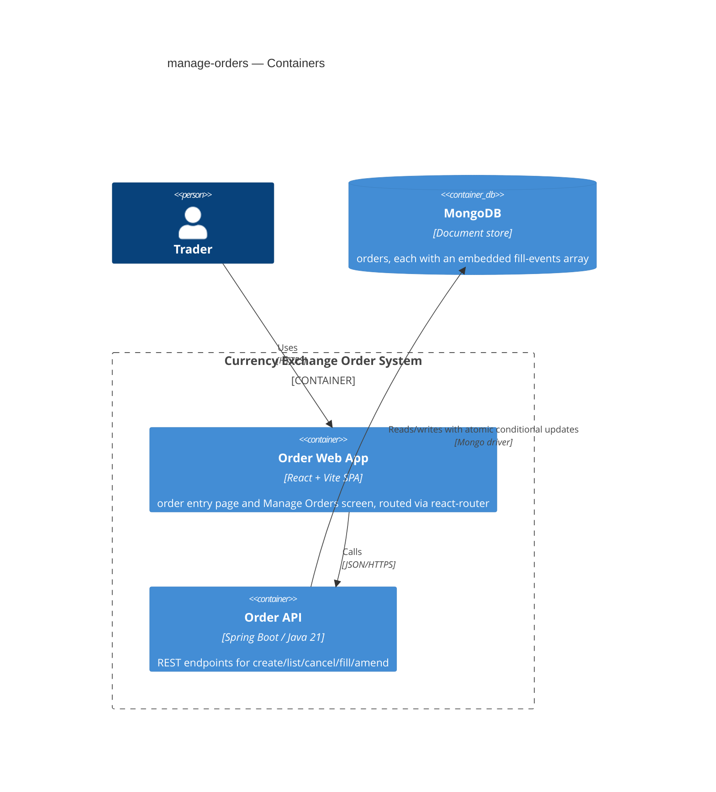
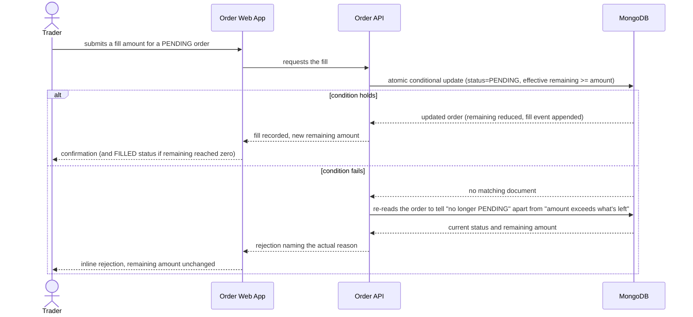
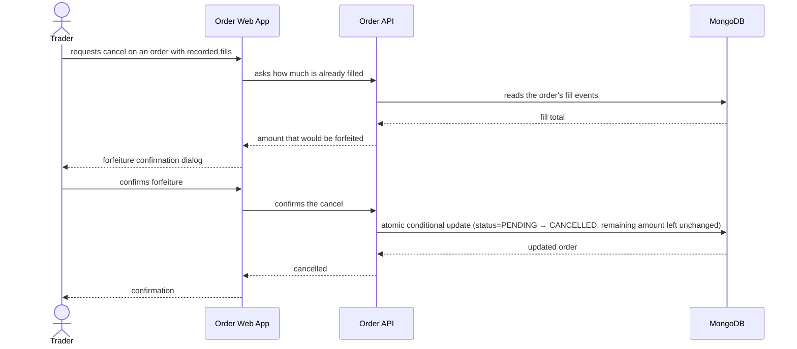
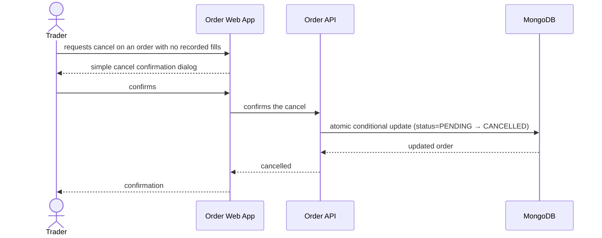
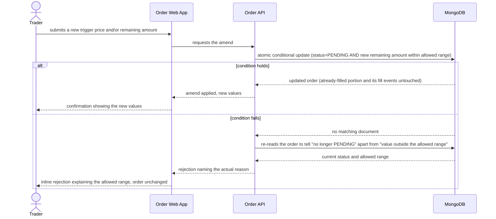
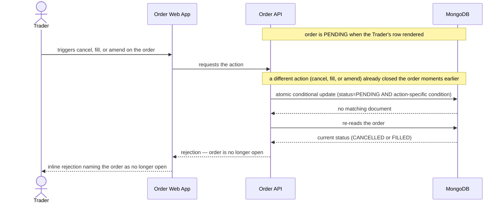

# Software Architecture Document — manage-orders

## 1. Introduction and goals

**Intent.** manage-orders gives the Trader a dedicated Manage Orders screen to Cancel, Fill, or Amend any pending order, plus a visible per-order fill trail — so every action that today requires a manual database edit becomes a UI action, and every order's remaining amount is always explainable from what's on screen. The order entry page becomes creation-only once this screen exists.

**Top-3 quality goals (1-liners; full scenarios in §10):**

1. Concurrency safety — no two actions (fill/cancel/amend) on the same order ever apply in a way that leaves it inconsistent, even when submitted at nearly the same time.
2. Traceability of derived state — every fill, full or partial, is individually visible so the Trader can always explain how an order's remaining amount was derived.
3. Zero-manual-edit completeness — the Trader can cancel, fill, or amend any pending order entirely from the UI, with each action usable within the Trader's own informal sub-30-second expectation.

**Stakeholders.**

| Role | Interest | Sign-off owner? |
|---|---|---|
| Trader | Uses Manage Orders and the entry screen daily; the sole actor and sole consumer of both | No |
| Tech Lead | SAD approval | Yes |
| Security Lead | Confirms no new authz/data-exposure surface is introduced (spec §6.1: none) | No |

## 2. Constraints

**Technical.**
- Java 21, Spring Boot, Maven — `backend/`.
- MongoDB (project runs 6.0.27 for local Windows compatibility; standalone single-node — no replica set, no multi-document transactions available).
- TypeScript, React, Vite — `frontend/`.
- Layered architecture convention (from the existing order-entry code): `model/` → `repository/` → `service/` → `controller/`, thin controllers, `OrderService` as the sole repository access point, bean-validated DTOs, uniform `ApiError` JSON via `GlobalExceptionHandler`.

**Organisational.**
- No hard deadline or effort budget stated in the spec; feature classified size S.
- Team: solo (Marisha).

**Conventions.**
- Extends the existing `com.currencyexchange.orderentry` package — no new backend module (see ADR-0001, ADR-0002 for the decisions that did cross the blast-radius gate).
- New DTOs follow `CreateOrderRequest`'s bean-validation pattern (`@Positive` etc.).
- New domain exceptions follow `OrderNotFoundException`'s pattern, handled by extending `GlobalExceptionHandler`.

**Regulatory / external.**
- N/A — internal single-user tool, no new personal-data fields, no compliance driver (spec §6.1).
- Inherited from the spec's own decision override: no authorization/ownership model is introduced by this feature (spec §1) — carried here as a fixed constraint, not re-opened by this design pass.

## 3. Context and scope

The single Trader manages currency-exchange orders end to end: creating them on the order entry page, then acting on them (cancel/fill/amend) and reviewing their fill trail on the Manage Orders screen. No external system participates — there is no execution engine, no market-data feed, and no identity provider; MongoDB is the system's only dependency.

<!-- brownfield: layered Spring Boot backend (model/repository/service/controller, Mongo-backed, no @Version/findAndModify/transactions in use today) + a router-less single-page React frontend, scanned directly for this pass (no docs/architecture-map.md exists yet — recommend running `/sdd:survey` to persist one). -->

**External systems (in / out):**

| Actor or system | Type | Interaction |
|---|---|---|
| Trader | Person | Creates, cancels, fills, and amends orders; views each order's fill trail |
| MongoDB | System (internal datastore) | Persists orders, including each order's embedded fill-event history |

**C4 Context (L1):**



The Trader is the only actor and talks to one system, which in turn depends on MongoDB as its sole datastore — no other system is involved in this feature.

## 4. Solution strategy

**Top strategic choices (the seeds for ADRs):**

1. **Continue the existing two-surface split** (`backend-service` + `web-frontend`) — manage-orders extends the surfaces order-entry already established rather than introducing a new one; no new module or deployment unit.
2. **Atomic conditional update over an embedded fill-events array** (ADR-0001) — cancel, fill, and amend are each a single guarded MongoDB write, but each guards a different condition and mutates differently: fill guards `status = PENDING` AND `effectiveRemaining >= amount` (where `effectiveRemaining` falls back to the order's original amount when `remainingAmount` was never set — see AC-11) and, on success, decrements `remainingAmount` and appends a fill event; cancel guards only `status = PENDING` and flips status to `CANCELLED` without touching `remainingAmount` or appending a fill event; amend guards `status = PENDING` AND the new value stays within the allowed range, and only updates `triggerPrice`/`remainingAmount`. A write whose guard fails is followed by a plain re-read of the order so the service can tell the Trader *why* (already closed vs. amount out of range) rather than a single undifferentiated rejection. Chosen over optimistic-locking retries or an in-process lock because it satisfies the AC-05/AC-13 concurrency NFR directly at the data layer, with no retry logic; see ADR-0001 for the full comparison.
3. **Introduce react-router for screen navigation** (ADR-0002) — `App.tsx` becomes a thin router shell with two routes so the entry page and Manage Orders each get their own URL (AC-15), replacing the current router-less single page. Chosen over hand-rolled History-API routing or separate Vite multi-page bundles as the standard, least-surprising way to give a two-screen SPA real navigation.
4. **No caching tier** — nothing in the app caches today; this feature introduces none.

Each tactical decision in later sections traces to one of these seeds.

## 5. Building block view

The backend stays a single layered Spring Boot module (model → repository → service → controller), extended in place rather than split — cancel/fill/amend are new operations on the existing `Order` aggregate, not a new bounded context. The frontend gains a thin routing layer (ADR-0002) splitting the existing single page into two routed screens that share the existing API client and type definitions.

**Internal decomposition:**

```
backend/src/main/java/com/currencyexchange/orderentry/
├── model/       Order (extended: FILLED status, remainingAmount, embedded fillEvents[]), OrderStatus, FillEvent
├── repository/  OrderRepository (existing MongoRepository<Order,String>) + OrderMongoOperations (new: MongoTemplate-based atomic update helpers, ADR-0001)
├── service/     OrderService (extended: guarded cancelOrder, new fillOrder, new amendOrder)
├── controller/  OrderController (extended: POST /api/orders/{id}/fill, PATCH /api/orders/{id}; existing DELETE for cancel)
├── dto/         FillRequest, AmendRequest (new); CreateOrderRequest, ApiError (existing)
└── exception/   OrderNotOpenException, InvalidFillAmountException, InvalidAmendException (new) + GlobalExceptionHandler (extended)

frontend/src/
├── App.tsx          thin router shell (ADR-0002): routes "/" and "/manage-orders"
├── pages/           OrderEntryPage (creation-only, AC-09), ManageOrdersPage (new)
├── components/      OrderEntryForm (existing, unchanged), OrderList.tsx (removed — its inline list + Cancel button are what AC-09 requires off the entry page), ManageOrdersList (new, takes over listing + adds Fill/Amend), CancelDialog / CancelForfeitureDialog / FillDialog / AmendDialog (new), FillTrail (new, inline row expansion)
├── api/orderApi.ts  extended: fillOrder(id, amount), amendOrder(id, {price?, remainingAmount?})
└── types/order.ts   extended: FILLED status, remainingAmount, FillEvent
```

**C4 Container (L2):**



Two containers make up the system: the Order Web App (now internally routed between the two screens) and the Order API, which is the only thing that talks to MongoDB, always through the atomic conditional updates ADR-0001 establishes.

## 6. Runtime view

**Critical flow 1: Record a fill, guarded against overfill and races (AC-03, AC-04, AC-05)**



**Critical flow 2: Cancel an order that already has fills (AC-02)**



**Critical flow 3: Cancel a pending order with no fills (AC-01)**



**Critical flow 4: Amend a pending order (AC-06, AC-07, AC-12)**



**Critical flow 5: View the order list and an order's fill trail (AC-08, AC-14)**

```mermaid
sequenceDiagram
    actor Trader
    participant Web as Order Web App
    participant API as Order API
    participant DB as MongoDB

    Trader->>Web: opens the Manage Orders screen
    Web->>API: requests all orders
    API->>DB: reads orders in every status
    DB-->>API: orders (PENDING, CANCELLED, FILLED)
    API-->>Web: full list
    Web-->>Trader: orders listed; Cancel/Fill/Amend enabled only on PENDING rows
    Trader->>Web: expands a row with recorded fill events
    Web-->>Trader: fill events shown, oldest first (amount + timestamp each)
```

**Critical flow 6: Attempt an action on a closed order — cross-action race guard (AC-10, AC-13)**



The remaining §5 acceptance criteria are non-runtime: AC-09 (entry page shows creation only, no list/Cancel) and AC-15 (entry page and Manage Orders reachable at distinct URLs) are client-side screen composition and routing decisions with no backend round-trip — see `ux-flows.md` US-06 for their flowchart. AC-11 (legacy orders with no recorded remaining amount) is a read-path fallback, not a distinct branch — see the "effective remaining" note in Critical flow 1.

## 7. Deployment view

<!-- N/A: reuses the existing deployment unit — same Spring Boot jar, same Vite static build, same single MongoDB instance; no new service, process, or infrastructure is introduced by this feature. -->

## 8. Crosscutting concepts

| Concept | Convention | Where defined |
|---|---|---|
| Logging | Repo's existing Spring Boot default logging, no feature-specific change | Existing config |
| Authentication | None — no accounts or sessions exist anywhere in the app; unchanged by this feature | Spec §1 decision override, §6.1 |
| Error handling | Domain exceptions (`OrderNotOpenException`, `InvalidFillAmountException`, `InvalidAmendException`) → `GlobalExceptionHandler` → uniform `ApiError` JSON, same pattern as `OrderNotFoundException` | `exception/GlobalExceptionHandler` |
| ID strategy | MongoDB's default generated `String` id, unchanged | `model/Order` |
| Internationalisation | N/A — single language | — |
| Observability | None beyond default Spring Boot logs; no metrics/tracing exist today | — |
| Events | N/A — no event system in this app | — |
| Concurrency guard (server) | Atomic conditional MongoDB update per action (ADR-0001) — the mechanism, not a separate pattern, is the crosscutting concept here | ADR-0001 |
| Double-submit guard (client) | Each action button (Cancel/Fill/Amend) is disabled for the duration of its in-flight request and re-enabled on response, success or rejection — a UI-side belt alongside the DB-side atomic guard (spec §2 Goals) | ux-flows.md US-05 |
| Responsive layout | Manage Orders and the entry page both work at any browser width — no desktop-only assumption (posture confirmed directly with the Trader; formalized project-wide once `/sdd:design-system` runs) | ux-flows.md Platform decisions |

## 9. Architecture decisions

| # | Title | Status | Section |
|---|---|---|---|
| 0001 | Use an atomic conditional update over an embedded fill-events array for order actions | Accepted | §4, §5 |
| 0002 | Introduce react-router for order-entry / manage-orders navigation | Accepted | §4, §5 |

ADR files live under `docs/features/manage-orders/adr/`.

## 10. Quality requirements

**QG-1. Concurrency safety**
- **When:** two of {fill, cancel, amend} are submitted for the same order at nearly the same time (including two overlapping fills whose combined amount exceeds what's remaining).
- **Then:** the system processes them one at a time; whichever would leave the remaining amount negative, or would apply to an order that's no longer PENDING, is rejected in full — never partially applied — so the order's remaining amount never goes below zero and never changes after it closes (spec §6 NFR: "no two actions ... ever apply concurrently in a way that leaves it inconsistent").
- **How verify:** an integration test that fires two concurrent requests (two fills, and a fill racing a cancel) against the same order and asserts exactly one succeeds and the remaining amount is never negative.

**QG-2. Traceability of derived state**
- **When:** any fill is recorded against an order, full or partial.
- **Then:** a fill event (amount + timestamp) is stored and later shown, oldest first, when the order's row is expanded (AC-08); the order's remaining amount always equals what the recorded fill events plus any amends imply.
- **How verify:** a unit test on the fill/amend arithmetic plus an e2e-through-UI test that records two partial fills and confirms both appear in the expanded trail in order.

**QG-3. Zero-manual-edit completeness**
- **When:** the Trader performs a cancel, fill, or amend from the Manage Orders screen.
- **Then:** the action completes entirely through the UI with no database edit, reflected immediately in the order's row. (Spec §6 leaves latency as an explicit TBD for this single-local-user tool — the "under 30 seconds" figure in spec §7 is an informal Trader-perceived KPI, not a latency SLO this feature is verified against.)
- **How verify:** AC coverage via an e2e-through-UI test per action, confirming the action completes with no manual data-layer step; the 30-second figure is checked informally by the Trader, not as an automated assertion.

## 11. Risks and technical debt

| Risk / debt | Severity | Mitigation | Owner |
|---|---|---|---|
| Legacy PENDING orders created before this feature have no remaining amount ever recorded (AC-11) | Medium | Service read path treats a missing remaining amount as equal to the order's original amount — a computed fallback, not a backfill migration | Marisha |
| Decimal rounding across multiple partial fills could leave a "phantom pending" (a near-zero-but-not-exactly-zero remaining amount that never auto-transitions to FILLED) | Open question | Resolve before `sdd:data-model` — pick a rounding-safe representation (e.g. a fixed-scale `BigDecimal` with an explicit near-zero check) | Marisha |
| No `docs/architecture-map.md` exists for this repo yet — this pass scanned the code directly | Low | Run `/sdd:survey` to persist a reusable map for future features | Marisha |
| `Order` documents grow with every fill event (ADR-0001's embedded-array shape) | Low | Acceptable at this feature's expected order/fill volume; revisit (separate `FillEvent` collection) only if fill counts per order grow large | Marisha |
| This feature is the first to need real test infrastructure: the repo has one mocked-repository unit test class (`OrderServiceTest`) and no integration-test harness, and the frontend has no test runner at all | Medium | Add an integration-test setup (e.g. an embedded/ephemeral MongoDB) for the concurrency scenarios in §10 QG-1, and a frontend test runner + e2e-through-UI tooling before those §10 verifications can run — scope this as setup work in `tasks`, not assumed-available tooling | Marisha |

**Accepted debt (acceptable in v1, plan to fix later):**
- No amend-history or audit trail — only an order's current state is visible, not a log of past amendments (spec §3 non-goal).
- No correction or reversal path for a wrongly-recorded fill or cancel — both are permanent once recorded (spec §3 non-goal; spec §8 open question tracks revisiting this).
- No latency/throughput/availability SLOs are tracked — this is a personal, single-local-user tool today (spec §6, spec §8 open question).
- No authorization/ownership model — matches the app's existing single-Trader scope (spec §1 decision override, spec §8 open question tracks revisiting this if ever deployed beyond personal use).

## 12. Glossary

| Term | Meaning |
|---|---|
| Amend | Editing a pending order's trigger price and/or remaining amount in place. Not cancel-and-recreate — the order keeps its identity and any existing fill history. |
| Fill | A manually recorded confirmation that some or all of an order's amount was executed. Not an automated match against a price feed. |
| Fill event | One timestamped record of a single fill against an order (amount + when). An order can have many fill events. |
| Remaining amount | The order's currently unfilled amount — normally original amount minus the sum of its fill events, but an amend can set it directly, after which it is the authoritative current value. Not the order's original amount, which stays fixed once created. |
| Trader | The single person who places, cancels, fills, and amends orders in this app. Not a role distinct from the app's owner/operator — there is exactly one, with no separate accounts. |
| Atomic conditional update | A single database write that only applies when a stated precondition (e.g. `status = PENDING` and enough remaining amount) still holds at write time — the mechanism ADR-0001 uses to make concurrent actions safe. |
