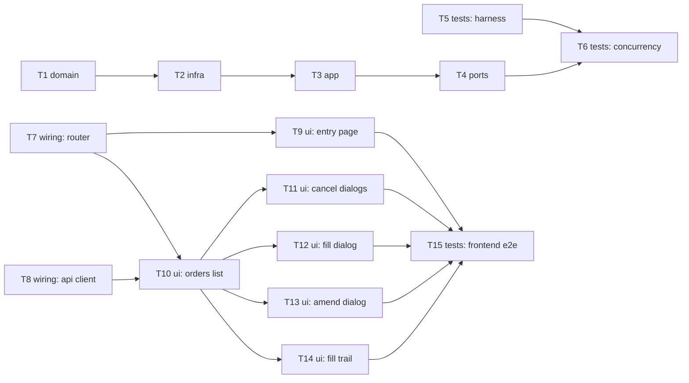

# Epic — manage-orders

> **Spec:** [spec.md](../spec.md) · **Design:** [sad.md](../sad.md) · **Data model:** [data-model.md](../data-model.md) · **API:** [openapi.yaml](../contracts/openapi.yaml) · **ADRs:** [adr/](../adr/)

## Goal

Give the Trader a dedicated Manage Orders screen to Cancel, Fill, or Amend any pending order — entirely from the UI, with zero manual database edits — plus a visible per-order fill trail so every order's remaining amount is always explainable. The order entry page becomes creation-only once this screen exists (spec §2 Goals).

## Scope

- **In:** backend (`model`/`repository`/`service`/`controller` extensions for cancel/fill/amend, atomic conditional updates, integration test harness) and frontend (react-router split, Manage Orders screen, four dialogs, fill trail, test runner) — the two `target_surfaces` this feature declares.
- **Out:** execution/matching engine, amend-history/audit trail, correction/reversal of a wrongly-recorded fill or cancel, any multi-user/authorization model (spec §3 Non-goals).

## Task map

Two independent chains (backend T1→T6, frontend T7→T15) can proceed in parallel; T5 and T7/T8 can start immediately alongside T1.

## Tasks

See [tracker.md](./tracker.md) for status. Machine contract: [tasks.json](../tasks.json).

| # | Task | Layer | Blocked by | DoD (short) |
|---|---|---|---|---|
| T1 | Extend Order model with FILLED status, remainingAmount, and embedded FillEvent | domain | — | Model compiles, existing test unmodified |
| T2 | Add MongoTemplate-based atomic conditional update helpers | infra | T1 | Guarded try* methods pass match/no-match unit tests |
| T3 | Implement guarded cancelOrder/fillOrder/amendOrder in OrderService | app | T1, T2 | Service unit tests cover every AC-01–07/10–13 branch |
| T4 | Add fill/amend endpoints, extend cancel + exception handling | ports | T3 | MockMvc tests confirm every status/code combination |
| T5 | Add an integration-test harness (ephemeral MongoDB) | tests | — | Harness-proof test passes with no local MongoDB |
| T6 | Write concurrency integration tests | tests | T4, T5 | Two concurrent-request tests pass reliably |
| T7 | Introduce react-router and split App.tsx into page shells | wiring | — | Both routes reachable directly by URL |
| T8 | Extend the API client and TS types | wiring | — | fillOrder/amendOrder typed and callable |
| T9 | Make the order entry page creation-only | ui | T7 | No list/Cancel on entry page; success banner shown |
| T10 | Build the Manage Orders list screen | ui | T7, T8 | All statuses listed, actions gated to PENDING |
| T11 | Build the Cancel and Cancel-with-forfeiture dialogs | ui | T10 | AC-01/AC-02 both dialogs work end to end |
| T12 | Build the Fill entry dialog | ui | T10 | AC-03/AC-04/AC-05 UI behavior works end to end |
| T13 | Build the Amend entry dialog | ui | T10 | AC-06/AC-07/AC-12 UI behavior works end to end |
| T14 | Build the expandable fill trail row | ui | T10 | AC-08 expand/collapse works, no extra request |
| T15 | Add a frontend test runner and e2e-through-UI tests | tests | T9, T11, T12, T13, T14 | One passing e2e test per UI-facing AC |

**Total:** 15 tasks, ~1 week (feature size S — spec.md frontmatter).

## Risks / Hard rules

- **Concurrency safety (spec §6 NFR, sad §10 QG-1):** no two actions (fill/cancel/amend) on the same order may ever apply concurrently in a way that leaves it inconsistent — enforced at the data layer via ADR-0001's atomic conditional update, never an application-level lock or retry loop. T2/T3 must not bypass `OrderMongoOperations` with a plain `save()` for these fields.
- **No multi-document transactions available** (sad §2 Constraints — standalone single-node MongoDB) — no task may introduce a dependency on a replica set or `@Transactional` across documents.
- **No authorization/ownership model** (spec §1 decision override) — no task may add auth checks; this is a fixed constraint, not an oversight to "fix."
- **Test infrastructure gap** (sad §11 risk row 5) — T5 and the test-runner half of T15 exist specifically because neither an integration-test harness nor a frontend test runner exists in this repo yet; skipping them would leave AC-05/AC-13/AC-09 etc. unverifiable by automation.
