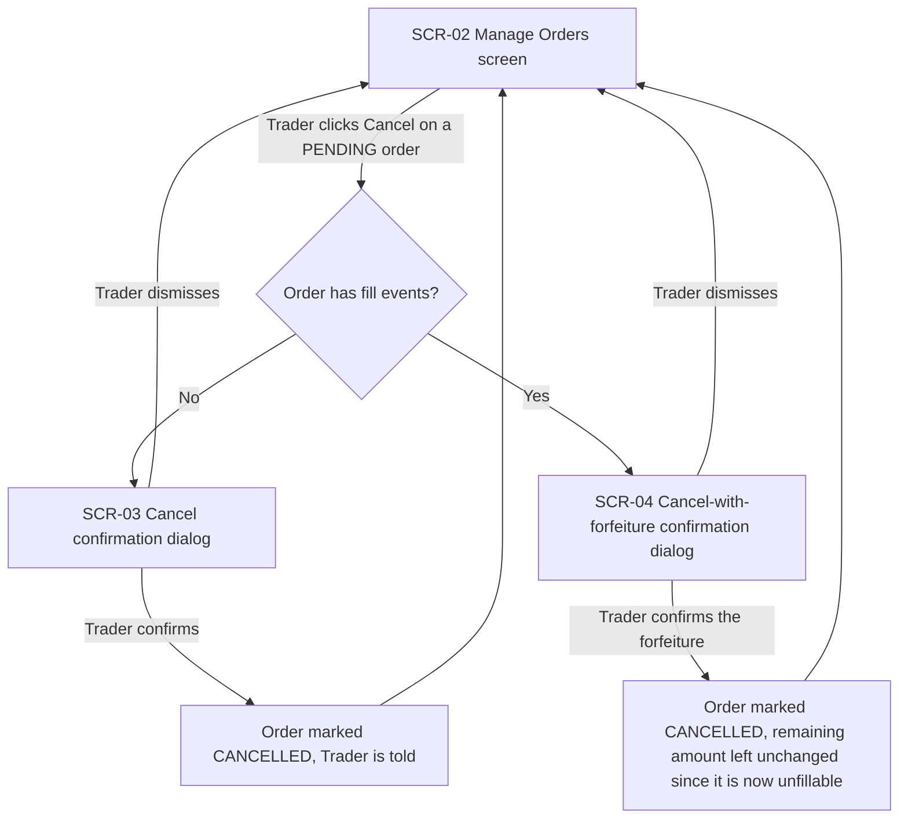
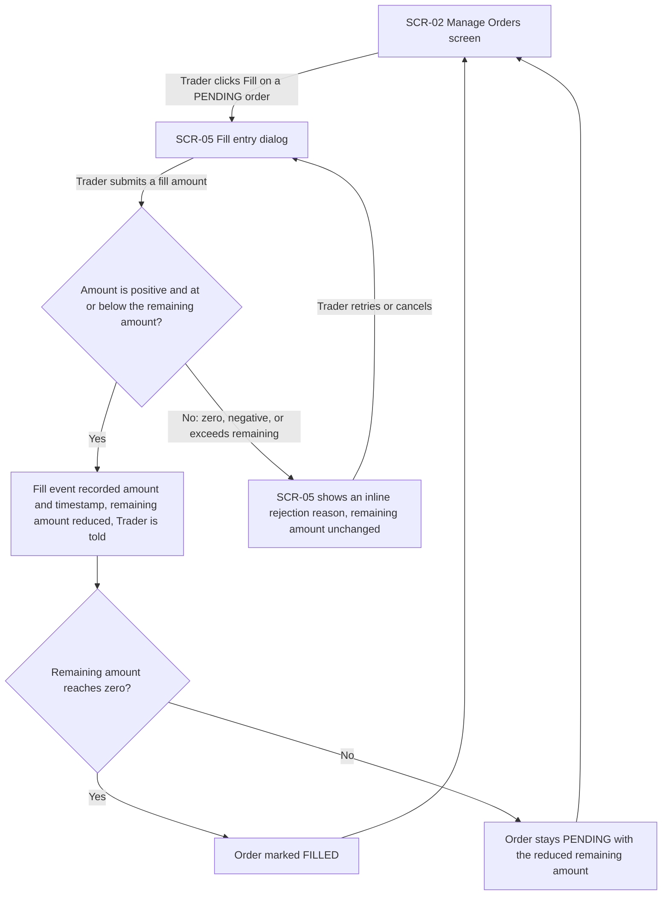
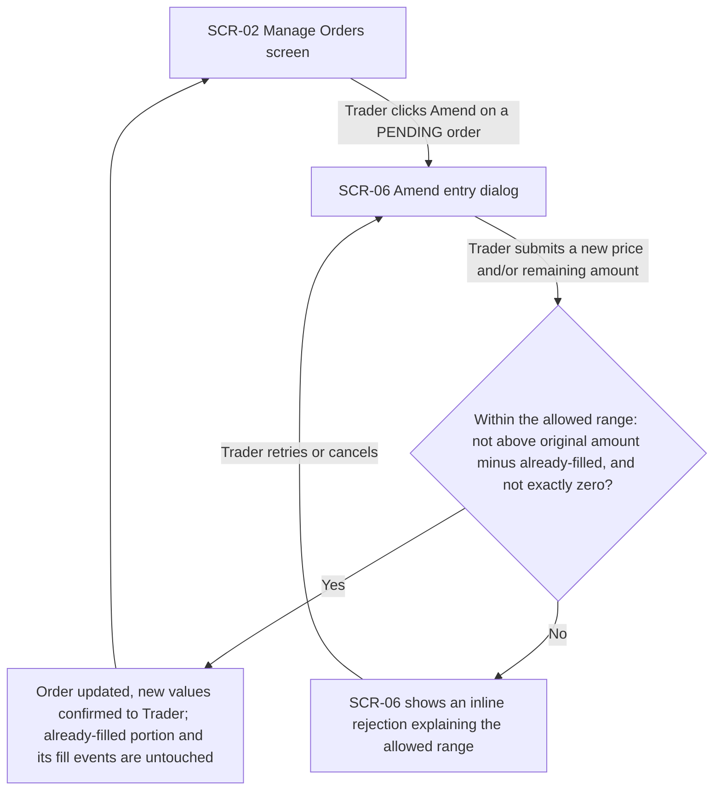
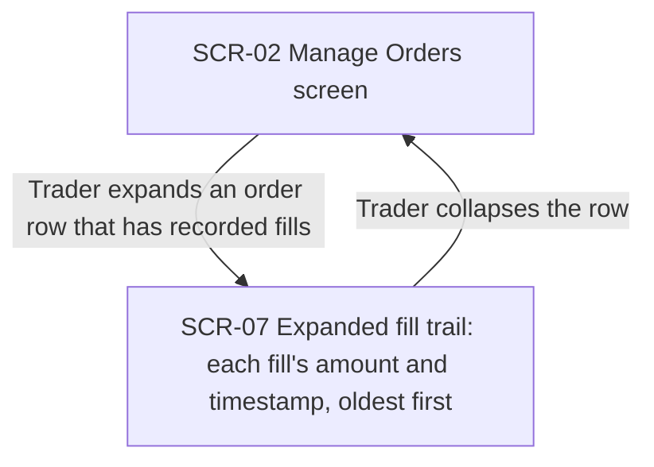
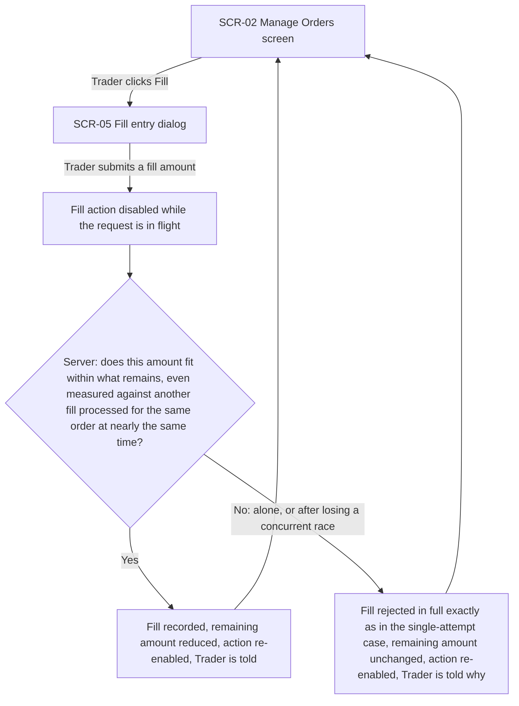
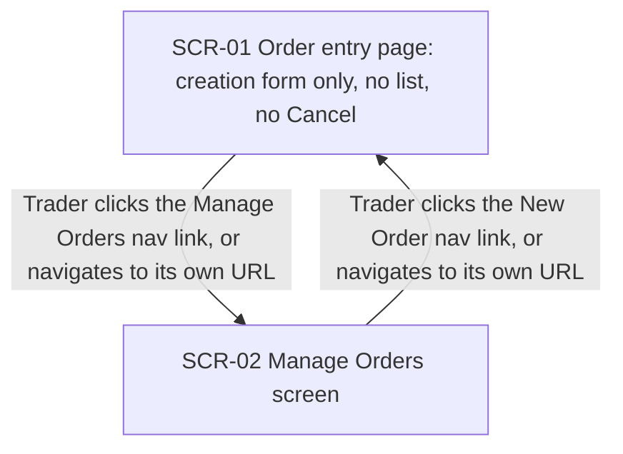
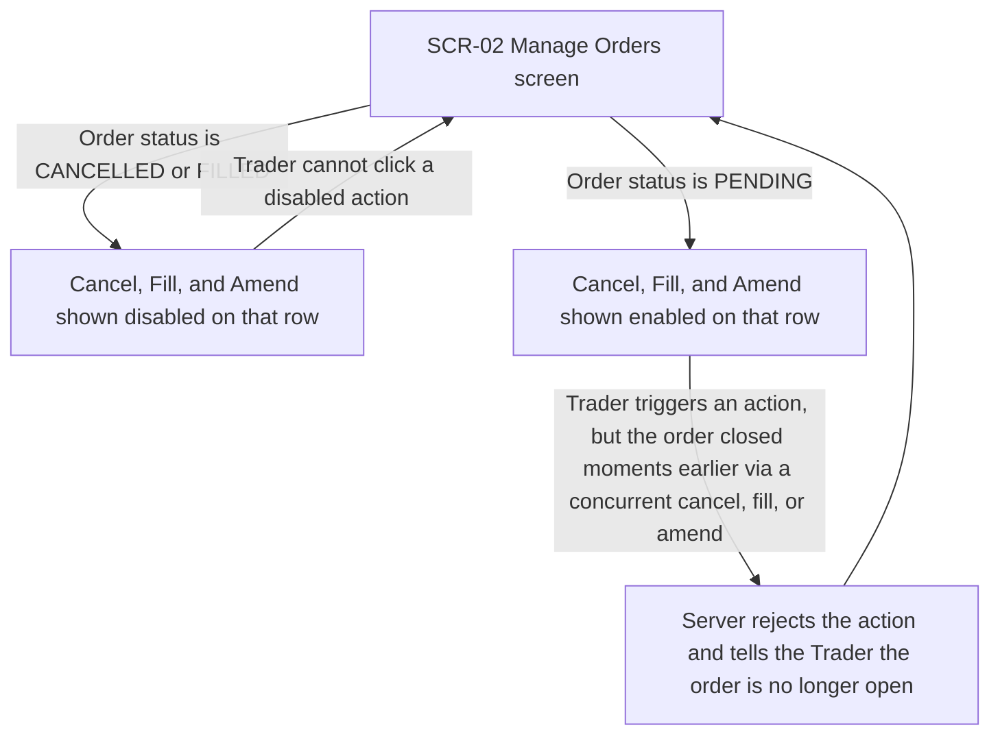

# UX flows — manage-orders

> User flows for every UI-touching §4 user story, produced by `ux-flows` (after `clarify`, before
> `design`) and read by `design` (evidence for the target-surface + UI-architecture decisions),
> `sequences` (UI-driven flows align on SCR ids), `screens` (details every inventory row) and
> `plan-tests` (the e2e-through-UI paths). **Always markdown + mermaid `flowchart`**, whatever the
> design tool — this artifact is flow-altitude, not visual design.

## Platform decisions

- **Posture:** responsive-both — `docs/design-system.md` does not exist yet in this repo, so there is no recorded posture to inherit. Confirmed directly with the Trader: flows assume the same actions and screens work whether the browser window is wide or narrow, rather than assuming a desktop-only layout. This is a code-mode assumption until `/sdd:design-system` is run and makes it official project-wide.
- Cancel, Fill, and Amend are each a **dialog launched from the order's row** on the Manage Orders screen, not a separate full-page navigation — keeps the Trader in one list view, consistent with the existing single-page app pattern described in `CLAUDE.md`.
- The fill trail (US-04) is an **inline expansion of the order's row**, not a separate screen — same single-list-view reasoning.
- Order entry and Manage Orders are **two distinct routes/URLs** (AC-15), not tabs or a single page with a mode switch — this is the one navigation-shape decision the spec directly requires.

## Screen inventory

| ID | Screen | Purpose | Entry | Exit |
|---|---|---|---|---|
| SCR-01 | Order entry page | Create a new order only — no list, no Cancel action (AC-09) | App default route, or the "New Order" nav link from SCR-02 | Nav link to Manage Orders (SCR-02) |
| SCR-02 | Manage Orders screen | Lists every order regardless of status; Cancel/Fill/Amend enabled only on PENDING rows (AC-14) | Nav link from SCR-01, or its own URL directly (AC-15) | Nav link to SCR-01; opens SCR-03/04/05/06 dialogs; expands SCR-07 inline |
| SCR-03 | Cancel confirmation dialog | Confirm cancelling a PENDING order with no fill events | Cancel action on a fill-free order, from SCR-02 | Back to SCR-02 (cancelled or dismissed) |
| SCR-04 | Cancel-with-forfeiture confirmation dialog | Second, explicit confirmation naming the amount forfeited, for a PENDING order that already has fills | Cancel action on an order with fills, from SCR-02 | Back to SCR-02 (cancelled or dismissed) |
| SCR-05 | Fill entry dialog | Record a fill amount against a PENDING order | Fill action on SCR-02 | Back to SCR-02 (recorded or dismissed); rejection shown inline without leaving the dialog |
| SCR-06 | Amend entry dialog | Adjust a PENDING order's trigger price and/or remaining amount | Amend action on SCR-02 | Back to SCR-02 (updated or dismissed); rejection shown inline without leaving the dialog |
| SCR-07 | Expanded fill trail | Shows each fill event's amount and timestamp, oldest first (AC-08) | Expand control on an order's row, from SCR-02 | Collapse back into the SCR-02 row |

## Flows

### Flow: US-01 — Cancel a pending order

The Trader clicks Cancel on a PENDING order from the Manage Orders screen. If the order has no fill events yet, a simple confirmation dialog appears and confirming marks it CANCELLED (AC-01). If the order already has one or more fills, a stronger dialog appears instead — it tells the Trader how much is already filled and requires an explicit second confirmation naming that the remaining amount will be permanently forfeited; confirming marks the order CANCELLED without resetting its remaining amount (AC-02). Dismissing either dialog returns to the list with no change.

### Flow: US-02 — Record a fill against an order

The Trader clicks Fill on a PENDING order and enters an amount in the fill dialog (for an order created before this feature existed and with no remaining amount ever recorded, the dialog treats the remaining amount as equal to the order's original amount, per AC-11). If the amount is positive and no more than what remains, the system records a new fill event, reduces the remaining amount, and tells the Trader — marking the order FILLED once the remaining amount reaches zero (AC-03). If the amount is zero, negative, or more than what remains, the dialog shows why inline and leaves the remaining amount unchanged, letting the Trader correct the amount or cancel (AC-04).

### Flow: US-03 — Amend a pending order

The Trader clicks Amend on a PENDING order and enters a new trigger price and/or remaining amount. A valid amend updates the order and confirms the new values, while never touching the already-filled portion or its fill events (AC-06). The remaining amount can only ever move within a bounded range — never above the order's original amount minus what's already been filled, and never down to exactly zero (the Trader must use Cancel for that); an amend outside that range is rejected inline with the allowed range explained, and the Trader can correct it or cancel (AC-07, AC-12).

### Flow: US-04 — View an order's fill trail

The Trader expands the row of an order that has one or more recorded fill events, and the row opens to show each fill's amount and timestamp, ordered oldest first, so the Trader can trust how the remaining amount was derived (AC-08). Collapsing the row returns to the plain list.

### Flow: US-05 — Be guarded against overfilling or duplicate fills

Once the Trader submits a fill amount, the Fill action is immediately disabled so a double-click or a double-submitted request can't be sent twice while the first is still processing (§2 Goals). On the server, fills against the same order are applied one at a time; if two fills arrive close together and their combined amount would exceed what remains, the one that would push the remaining amount negative is rejected in full — never partially applied — so the order's remaining amount never goes below zero (AC-05), using the exact same rejection shown for a single-attempt overfill (AC-04).

### Flow: US-06 — Keep the entry page creation-only

The order entry page shows only the creation form — the inline order list and its Cancel button, present before this feature, are removed (AC-09). The entry page and the Manage Orders screen each live at their own distinct URL, so the Trader can navigate directly to either one or move between them via a nav link (AC-15).

### Flow: US-07 — Be prevented from acting on a closed order

The Manage Orders screen lists orders in every status; Cancel/Fill/Amend are enabled only on PENDING rows and disabled on CANCELLED/FILLED ones, so there's nothing to click on a closed order in the normal case (AC-14). The remaining case is a race: an order can close via a different concurrent action (a cancel landing while a fill was in flight, for example) between when the row rendered and when the Trader's click reaches the server — that action is rejected once the closing action has taken effect, and the Trader is told the order is no longer open, the same way for any of cancel/fill/amend (AC-10, AC-13).

## AC coverage

| AC | Shown by | Notes |
|---|---|---|
| AC-01 | Flow US-01 → no-fills branch | Simple confirm → CANCELLED |
| AC-02 | Flow US-01 → has-fills branch | Forfeiture confirm, remaining amount left unchanged |
| AC-03 | Flow US-02 → valid-amount branch | Includes the FILLED auto-transition at zero remaining |
| AC-04 | Flow US-02 → invalid-amount branch | Also referenced by Flow US-05 as the same rejection surface |
| AC-05 | Flow US-05 → server race branch | One-at-a-time processing; loser rejected in full |
| AC-06 | Flow US-03 → in-range branch | |
| AC-07 | Flow US-03 → in-range branch (node D) | Bound and fill-event immutability stated in the prose |
| AC-08 | Flow US-04 | Oldest-first ordering stated in the prose |
| AC-09 | Flow US-06 → SCR-01 node | |
| AC-10 | Flow US-07 → race branch | Rejection message shared with AC-13 |
| AC-11 | Flow US-02 → prose | Display/derivation rule (legacy remaining amount), not a separate branch |
| AC-12 | Flow US-03 → out-of-range branch | |
| AC-13 | Flow US-07 → race branch | Generalizes AC-10's closed-order guard to any concurrent action pair |
| AC-14 | Flow US-07 → PENDING vs closed branches | |
| AC-15 | Flow US-06 | Distinct URLs stated in the prose |

